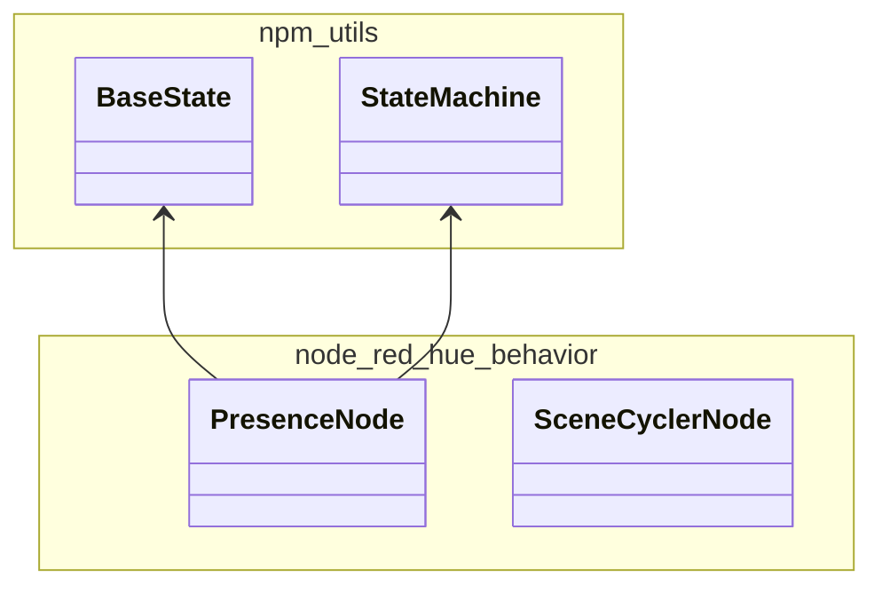

# node-red-hue-behavior

# Introduction

This is a collection of behavior node that works together with nodes from the `node-red-hue-services` package,
which is a library of nodes that work with the `Clip` api offered by Signify's hue bridge.

Where `hue-services` is more or less a direct mapping of the existing `Clip` services to a `node-red` node, the
`hue-behavior` nodes are aimed at making these services easier to use by offering advanced and/or complex automation to
couple things together.

# Status

Currently only one node is available, and this is still a work in progress. The [Presence](/src/nodes/presence/design.md) node aims to combine contact and motion sensors into a more reliable `presence` signal that can be used to change light states.

## Dependencies
 - debug: ^4.4.3

## Changelog
#### v0.7.0: Split the package into functionally separate parts:
 - [@hurenkam/npm-utils](https://github.com/hurenkam/npm-utils): New utility package which contains finite state machine base classes.
 - [@hurenkam/npm-hue-clip-v2](https://github.com/hurenkam/npm-hue-clip-v2): Contains the classes that deal with interfacing with the bridge using clip v2, and can be used outside of node-red as well.
 - [@hurenkam/node-red-hue-base](https://github.com/hurenkam/node-red-hue-base): Contains the `BridgeConfig` node and the `Service` node, these are the basic node-red nodes that enable interacting with any clip v2 service (depends on [@hurenkam/npm-hue-clip-v2](https://github.com/hurenkam/npm-hue-clip-v2))
 - [@hurenkam/node-red-hue-services](https://github.com/hurenkam/node-red-hue-services): This is mostly an eye-candy package, and contains specialized nodes for many known service types, with separate colors and type specific status feedback (depends on [@hurenkam/node-red-hue-base](https://github.com/hurenkam/node-red-hue-base)).
 - [@hurenkam/node-red-hue-behavior](https://github.com/hurenkam/node-red-hue-behavior): This is a new package with nodes that can do more complex automation using messages from/to services as defined in [@hurenkam/node-red-hue-base](https://github.com/hurenkam/node-red-hue-base) and [@hurenkam/node-red-hue-services](https://github.com/hurenkam/node-red-hue-services). Note that it does not depend on these packages specifically, as the dependency is on the message level only, and thus could be triggered/used by any other logic outside this package as well. It does depend on [@hurenkam/npm-utils](https://github.com/hurenkam/npm-utils) for the state machine behavior.

## Todo
 - ~~Multiple contact sensors support for `Presence` node~~
 - Scene cycler & dimmer to combine buttons & rotary inputs
 - Room/zone automation that combines automated and manual behavior

# Use

# Design
