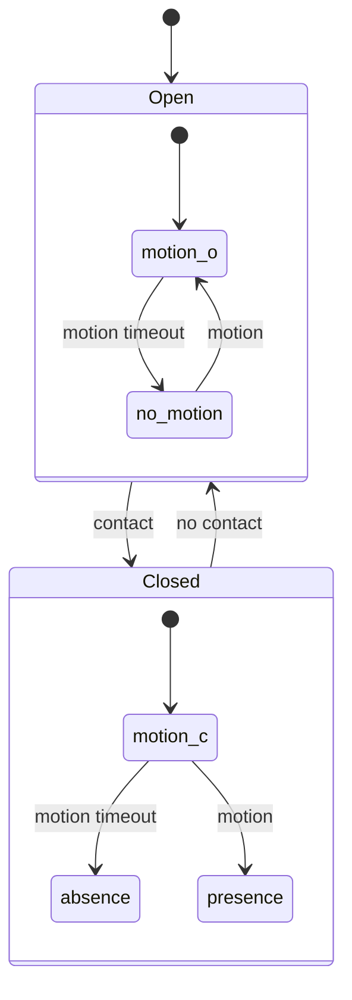

# Presence node
This node can be used to combine multiple contact sensors and motion sensors to provide a more stable presence sensor.
When contact sensors are closed, and motion is detected, it will trigger a `presence` state, which will remain until a contact sensor indicates a door has been opened again.

## State diagram
State behavior is as follows:

## Output
Output payload looks like this:
```
{
    "payload": {
        "type": "state",
        "state_report" {
            "state": "absence"
        }
    }
}
```
The `presence` and `absence` states correspond with their respective states in the diagram above. `motion_c` and `motion_o` states will be presented as `motion` to the outside, but are actually different states.